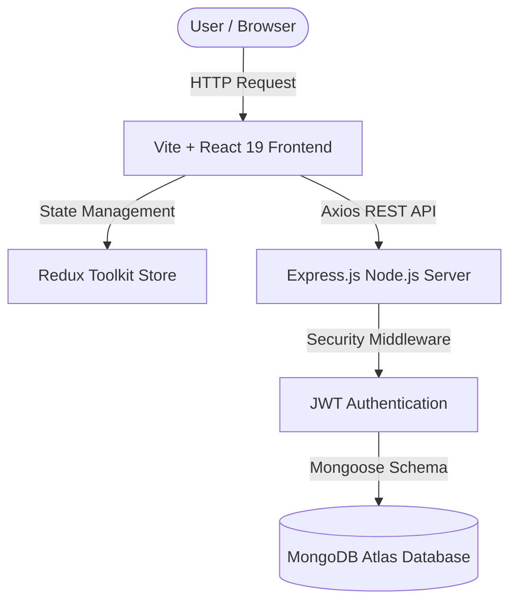

# ElectroTask – Enterprise Task & Project Management Dashboard

> **ElectroTask** is a modern, high-performance enterprise project and task management dashboard designed to streamline team collaboration, real-time activity tracking, agile sprint planning, and interactive project workflows. It delivers an intuitive RTL Arabic interface, dynamic statistical analytics, live task filtering, and robust security.

---

## 🌐 Live Preview

- 🌐 **Watch Live Demo:** [https://eletro-pi-task-management-dashboard.vercel.app](https://eletro-pi-task-management-dashboard.vercel.app/)

---

## 💻 Used Technologies

- **React 19 & TypeScript:** Provides type-safe UI component architecture, enhanced maintainability, and high-performance rendering.
- **Vite 8:** Lightning-fast build tool and development server with instant Hot Module Replacement (HMR).
- **TailwindCSS:** Modern utility-first CSS engine enabling custom RTL design tokens, responsive layouts, and polished micro-animations.
- **Redux Toolkit & React-Redux:** Predictable global state management for user authentication, session persistence, and workspace state.
- **Node.js & Express.js:** Scalable RESTful backend server architecture handling API requests, security middleware, and authentication.
- **MongoDB & Mongoose ORM:** Flexible NoSQL document store with strict schema validation, indexes, and automated timestamps.
- **Bcrypt.js & JSON Web Tokens (JWT):** Enterprise-grade security with hashed password storage and HTTP-only cookie session handling.
- **Lucide React:** Lightweight, accessible icon system for clean visual hierarchy.
- **Figma:** System interface design, component wireframing, and visual prototyping.
- **Hosting Infrastructure:** Deployed on **Vercel** (Frontend) and **MongoDB Atlas** (Database Cloud Storage).

---

## ✨ Key Features

- **📊 Central Analytics Dashboard:** Real-time metrics overview displaying active project count, pending tasks, completion rate gauges, and team size.
- **📁 Full Project Lifecycle Management:** Create, edit, filter, and track project status (`قيد التنفيذ`, `حرج`, `معلق`, `مكتمل`) with interactive progress bars.
- **📋 Interactive Tasks Engine:** End-to-end task assignment, status transition selectors (`todo`, `doing`, `review`, `done`), priority badges, and quick deletion.
- **👥 Team & Contributor Directory:** Manage team members, update job roles/departments, invite new contributors, and permanently remove members.
- **🔍 Instant Live Search & Filter Popover:** Global header search and popovers for filtering tasks by priority, status, and sorting order.
- **⚙️ Profile & System Settings:** Complete profile editing, avatar preview/upload, notification preference toggles, and password change security.
- **🆘 Technical Support Hub:** Searchable FAQ accordion and interactive support ticket submission with live history tracker.

---

## 📐 System Architecture & Program Flow

Detailed architectural documentation, ERD diagrams, and UML program flow models are available in [docs/ARCHITECTURE.md](./docs/ARCHITECTURE.md).



---

## 🛠 Best Practices and Standards Followed

### 1. SOLID Principles & OOP Architecture
- **Single Responsibility Principle (SRP):** Components are decoupled into focused sub-components (e.g., `ProjectsFilterBar`, `ProjectsTable`, `ProjectDetailsHeader`).
- **Open/Closed Principle (OCP):** UI cards and layout wrappers are extensible through clean props without modifying internal code logic.
- **Dependency Inversion Principle (DIP):** Modules consume abstract API helpers (`projects.api.ts`, `auth.api.ts`) rather than direct HTTP clients.

### 2. Performance Optimization
- **Parallel Data Fetching:** Uses `Promise.all()` to load dashboard metrics simultaneously, avoiding sequential blocking waterfalls.
- **Component Memoization & Fragments:** Avoids unnecessary DOM re-renders by wrapping sibling elements in React Fragments (`<>...</>`).
- **Overfetching Avoidance:** Backend queries projection fields and returning optimized payloads (`.select('-password')`).
- **Dynamic Pagination:** Slices data on the client or database level to prevent rendering heavy DOM nodes simultaneously.

### 3. User Experience (UX) & Error Recovery
- **Error Boundaries & Fallback UI:** Friendly empty state illustrations and clear error recovery notifications when network or validation issues occur.
- **404 Not Found Page:** Custom fallback direction routing users back to `/dashboard`.
- **Shareable Search Parameters:** Synchronizes filter states with search parameters for bookmarking and URL sharing.

### 4. Security & SEO Standards
- **Password Hashing:** Uses `Bcrypt` with salt rounds for credential protection.
- **HTTP-Only Cookies:** Stores JWT tokens inside secure `httpOnly` cookies to protect against Cross-Site Scripting (XSS).
- **SEO & Open Graph Tags:** Includes meta titles, Open Graph tags, Twitter cards, `robots.txt`, `sitemap.xml`, and JSON-LD structured data (`schema.org/WebApplication`).

---

## 📥 Installation Instructions for Local Setup

### Prerequisites
- **Node.js** (v18.0.0 or higher)
- **npm** or **yarn**
- **MongoDB** (Local instance or MongoDB Atlas Connection URI)

### 1. Clone the Repository
```bash
git clone https://github.com/Ahmed-Maher77/Electro-PI___Task-Management-Dashboard.git
cd Electro-PI___Task-Management-Dashboard
```

### 2. Backend Setup
```bash
cd server
npm install
```
Create a `.env` file inside the `server/` folder:
```env
PORT=5000
NODE_ENV=development
MONGODB_URI=mongodb://localhost:27017/electro-pi-dashboard
JWT_SECRET=super_secret_jwt_key_12345
CLIENT_URL=http://localhost:5173
```
Run the development backend server:
```bash
npm run dev
```

### 3. Frontend Setup
Open a new terminal tab:
```bash
cd client
npm install
npm run dev
```
Open your browser at `http://localhost:5173`.

---

## 📁 Project Structure

```
Electro-PI___Task-Management-Dashboard/
├── client/                     # Vite + React 19 Frontend
│   ├── public/                 # Static assets, favicon, robots.txt, sitemap.xml
│   ├── src/
│   │   ├── api/                # Axios REST API service helpers (auth, projects, tasks)
│   │   ├── components/         # Decoupled UI components grouped by feature area
│   │   │   ├── dashboard/      # StatCards, RecentActivity, RecentTasksList
│   │   │   ├── projects/       # ProjectsFilterBar, ProjectsTable, ProjectDetails components
│   │   │   ├── tasks/          # TasksFilterBar, TasksTable, TaskAttributesSidebar
│   │   │   ├── team/           # TeamHeader, TeamTable, InviteMemberModal
│   │   │   ├── settings/       # SettingsTabs, UserProfileSettingsForm, SecuritySettingsForm
│   │   │   └── support/        # SupportCards, SupportForm, FaqAccordion
│   │   ├── pages/              # Main route views (Dashboard, Projects, Tasks, Team, Profile, Settings)
│   │   ├── routes/             # Protected and Public Route guards
│   │   ├── store/              # Redux Toolkit store & authSlice
│   │   ├── types/              # Centralized TypeScript interface definitions (index.ts)
│   │   ├── App.tsx             # Root Application layout component
│   │   └── main.tsx            # Application entrypoint
│   └── index.html              # HTML entrypoint with full SEO & Open Graph meta tags
├── server/                     # Node.js + Express.js Backend Server
│   ├── src/
│   │   ├── config/             # Environment & MongoDB connection setup
│   │   ├── controllers/        # Express request handlers (auth, project, task)
│   │   ├── middleware/         # JWT authentication, error handling, input validation
│   │   ├── models/             # Mongoose schemas (User, Project, Task)
│   │   ├── routes/             # Express REST route endpoints
│   │   ├── services/           # Core business logic layer
│   │   ├── utils/              # ApiError, ApiResponse, asyncHandler wrappers
│   │   └── server.js           # Express server entrypoint
├── docs/                       # Comprehensive Project Documentation
│   ├── API.md                  # REST API Endpoints Specification
│   ├── DATABASE.md             # MongoDB Schemas & ERD Diagram
│   └── ARCHITECTURE.md         # System Architecture & Flow Diagrams
└── README.md                   # Project Documentation Entrypoint
```

---

## 🗄 Database Structure

The project utilizes three core Mongoose collections: **Users**, **Projects**, and **Tasks**. 

For complete Mongoose schema specifications and Entity-Relationship Diagrams (ERD), consult [docs/DATABASE.md](./docs/DATABASE.md).

---

## 🔌 API Documentation

Complete REST API endpoint specifications, payload examples, and HTTP response codes are documented in [docs/API.md](./docs/API.md).

---

## 📬 Contact & Contribution

- **Portfolio:** [ahmedmaher-portfolio.vercel.app](https://ahmedmaher-portfolio.vercel.app)
- **LinkedIn:** [linkedin.com/in/ahmed-maher-algohary/](https://www.linkedin.com/in/ahmed-maher-algohary/)
- **GitHub:** [github.com/Ahmed-Maher77](https://github.com/Ahmed-Maher77)
- **Email:** [ahmedmaher.dev1@gmail.com](mailto:ahmedmaher.dev1@gmail.com)

Contributions, issues, and feature requests are welcome! Feel free to check the issues page.

---

## ⭐ Support

If you found this project helpful or inspiring, please give it a **⭐ Star** on GitHub!
