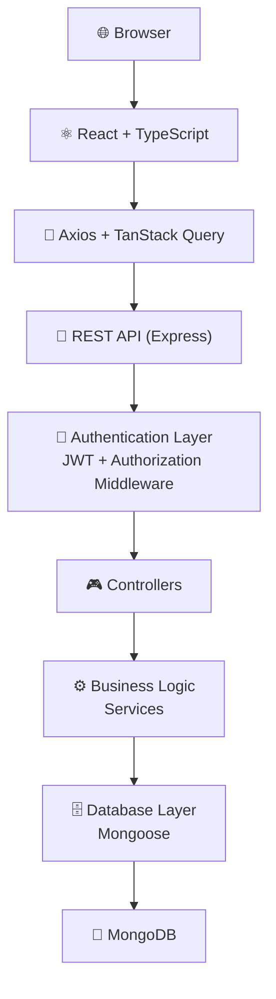

# Electro PI — Task Management Dashboard

A full-stack task management application built with React, TypeScript, and Express, featuring JWT-based authentication and a MongoDB data layer.

## Tech Stack

| Layer       | Technology                        |
| ----------- | --------------------------------- |
| Frontend    | React 19, TypeScript, Vite        |
| HTTP Client | Axios, TanStack Query             |
| Backend     | Express 5                         |
| Auth        | JWT (jsonwebtoken), bcrypt        |
| Validation  | express-validator                 |
| Database    | MongoDB via Mongoose 9            |
| Security    | Helmet, CORS, cookie-parser       |
| Logging     | Morgan                            |

## Architecture



## Project Structure

```
├── client/                  # React frontend
│   ├── src/
│   │   ├── App.tsx
│   │   ├── main.tsx
│   │   ├── index.css
│   │   └── App.css
│   ├── package.json
│   ├── vite.config.ts
│   └── tsconfig.json
├── server/                  # Express backend
│   ├── server.js
│   ├── package.json
│   └── node_modules/
└── README.md
```

## Getting Started

### Prerequisites

- Node.js >= 18
- MongoDB instance (local or Atlas)

### Installation

```bash
# Install server dependencies
cd server
npm install

# Install client dependencies
cd ../client
npm install
```

### Configuration

Create a `.env` file in the `server/` directory:

```env
PORT=5000
MONGODB_URI=mongodb://localhost:27017/task-management
JWT_SECRET=your-secret-key
JWT_EXPIRES_IN=7d
```

### Running the Application

```bash
# Start the server (with nodemon for development)
cd server
npm run dev

# Start the client (in a separate terminal)
cd client
npm run dev
```

The client runs on `http://localhost:5173` and the API on `http://localhost:5000`.

## Author

**Ahmed Maher Algohary**

## License

ISC
