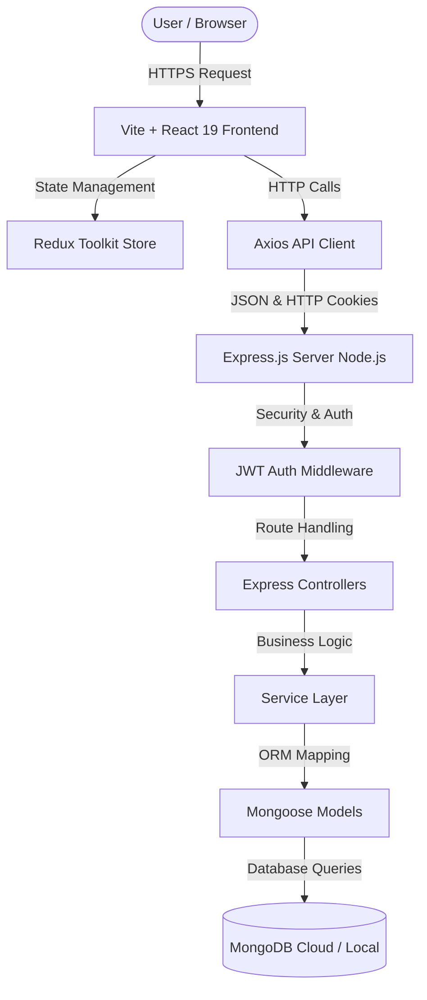

# 📐 ElectroTask System Architecture & Program Flow

ElectroTask is designed following a decoupled, layered client-server architecture.

---

## 🏗 High-Level Architecture Diagram

---

## 🔄 Program Execution Flow

1. **Authentication Flow**:
   - User submits login/registration credentials.
   - Server authenticates password via Bcrypt, generates a 7-day JWT, and sets an `httpOnly` secure cookie.
   - Client Redux store updates user state, unlocking protected dashboard routes.

2. **Dashboard & Analytics Engine**:
   - On page mount, `Dashboard.tsx` fetches projects, tasks, and users in parallel using `Promise.all()`.
   - Dynamic indicators recalculate pending tasks, high-priority counts, completion rate, and team count.
   - Recent activity stream combines project and task updates dynamically.

3. **Project & Task Workflow**:
   - User creates or updates a project/task via interactive UI modals.
   - Changes are sent to Express controllers via REST requests (`POST`, `PATCH`, `DELETE`).
   - Server updates MongoDB, returning updated JSON to the client, which immediately re-renders local state.
