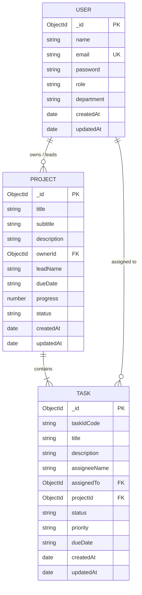

# 🗄 ElectroTask Database Architecture & Schemas

ElectroTask utilizes **MongoDB** as its primary NoSQL database, structured using **Mongoose ORM**.

---

## 📊 Entity Relationship Diagram (ERD)

---

## 📄 Schemas Definition

### 1. User Schema ([User.js](file:///c:/Users/Ahmed%20Maher/Downloads/eletro-pi___task-management-dashboard/server/src/models/User.js))
- `name`: String (Required, trimmed)
- `email`: String (Required, unique, lowercase)
- `password`: String (Required, bcrypt hashed)
- `role`: String (Enum: `['user', 'admin']`, Default: `'user'`)
- `department`: String (Default: `'تطوير البرمجيات'`)

---

### 2. Project Schema ([Project.js](file:///c:/Users/Ahmed%20Maher/Downloads/eletro-pi___task-management-dashboard/server/src/models/Project.js))
- `title`: String (Required)
- `subtitle`: String
- `description`: String
- `ownerId`: Schema.Types.ObjectId (Ref: `'User'`)
- `leadName`: String (Default: `'أحمد ماهر'`)
- `dueDate`: String
- `progress`: Number (Min: 0, Max: 100, Default: 0)
- `status`: String (Enum: `['in-progress', 'critical', 'on-hold', 'completed']`)

---

### 3. Task Schema ([Task.js](file:///c:/Users/Ahmed%20Maher/Downloads/eletro-pi___task-management-dashboard/server/src/models/Task.js))
- `taskIdCode`: String (Unique auto-generated, e.g. `EPI-1042`)
- `title`: String (Required)
- `description`: String
- `assigneeName`: String (Default: `'سارة محمود'`)
- `assignedTo`: Schema.Types.ObjectId (Ref: `'User'`)
- `projectId`: Schema.Types.ObjectId (Required, Ref: `'Project'`)
- `status`: String (Enum: `['todo', 'doing', 'review', 'done', 'in-progress']`)
- `priority`: String (Enum: `['low', 'medium', 'high']`)
- `dueDate`: String
